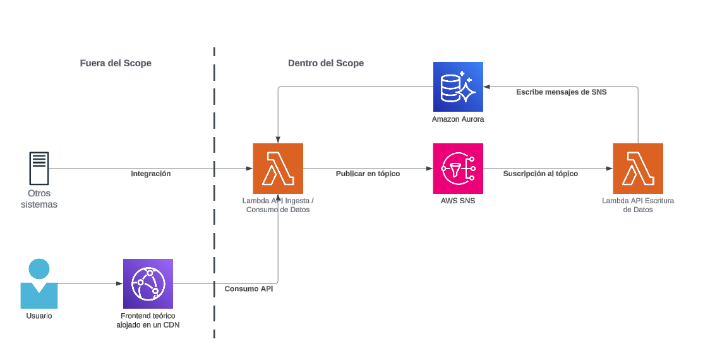
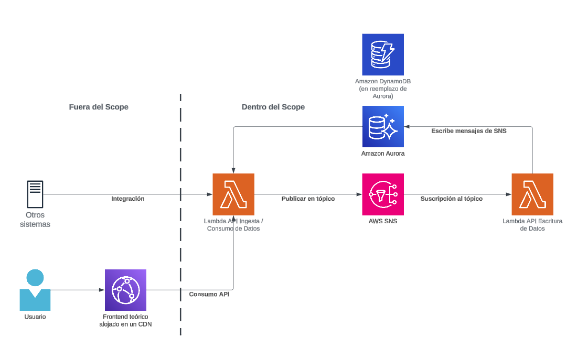

# Parte 1: Infraestructura e IaC

## Identificación Infraestructura
- **Base de Datos**: Se utilizará una base de datos relacional dado que es más compatible para procesar analítica avanzada y conectarla en un futuro con alguna solución de Data Analytics como Google BigQuery, Amazon Redshift o Snowflake, que es parte del requerimiento. Dado que en este caso estamos proponiendo una arquitectura en AWS, la tecnología escogida será Aurora PostgreSQL.
- **Tecnología Pub/Sub**: Existen diversas tecnologías para lograr este propósito, en particular por experiencia personal he utilizado SNS/SQS, RabbitMQ y Redis, sintiendo que todas en general cumplen el propósito y la elección en particular tiene que ir por decisiones previas (si ya se cuenta con una tecnología para Pub/Sub utilizada es mejor mantenerla para evitar fragmentación de tecnologías) o features específicos de una cola de mensajería (como AMQP). Dado que estamos proponiendo una solución simple administrada por AWS, escogeremos SNS/SQS para este ejemplo.
- **Endpoint HTTP para servir datos almacenados**: En general soy más de la idea de utilizar de microservicios basadas en contenedores orquestadas por Kubernetes, utilizando las opciones administradas en la nube como Google Cloud GKE o Amazon EKS, si bien la curva de aprendizaje no es menor, permiten mucha flexibilidad y escalabilidad, y con un buen pipeline de CI/CD se pueden abstraer lo suficiente de los desarrolladores para que solo se centren en escribir código y no preocuparse por la infraestructura. En este caso sin embargo, por simplicidad escogeremos implementar funciones AWS Lambda para lograr el propósito, dado que por ejemplo, en un contexto de piloto, puede ser muy útil levantar una prueba de concepto de bajo costo antes de hacer un deploy más altamente disponible y enterprise grade.

Finalmente, esto se ve representado en el siguiente diagrama de arquitectura de la solución:

## Despliegue de infraestructura mediante código Terraform
### Disclaimers
- Cómo correr los scripts terraform son parte del [quick start guide](https://developer.hashicorp.com/terraform/tutorials/aws-get-started/aws-build).
- Los códigos Terraform fueron generados mediante ChatGPT, sin embargo, se probaron contra una cuenta AWS y editados para corregir errores o detalles durante la generación de las propuestas de scripts (ej: El script de creación de VPC utilizaba un argumento deprecado en la creación del NAT Gateway).
- La contraseña de RDS está definida en variables.tf lo que es una mala práctica. Se realizó por simplicidad pero se recomendaría utilizar un almacenamiento de secretos como AWS Secrets Manager.

### Descripción de los scripts:
- Configuración Base (main.tf / variables.tf): Contiene definiciones generales como la zona AWS del despliegue y variables a utilizar.
- VPC (vpc.tf): Este código despliega una VPC con dos subnets privadas y dos públicas, en las zonas 1A y 1B de Virginia del Norte (us-east-1).
- RDS (rds.tf): Se levantará un servidor de Aurora PostgreSQL Serverless para almacenamiento de datos.
- SNS/SQS (pubsub.tf): Se utilizará SNS/SQS de AWS como tecnología para tener una arquitectura Pub/Sub. Existen otras tecnologías como Apache Kafka, RabbitMQ o Redis.
- Lambda (lambda.tf): Levanta una función AWS Lambda a partir de una imagen Docker compatible.

# Parte 2: Aplicaciones y flujo CI/CD

## API HTTP
- Se creó un handler simple de Lambda que expone dos endpoints. Un endpoint GET el que consultará la base de datos y devolverá las rows de una tabla en formato JSON y un endpoint POST que publicará un mensaje en el tópico SNS.

## Deploy
- Se creó workflow de Github Actions que hace deploy de la función Lambda a una cuenta AWS cuyos parámetros se definen en secrets de Github.
- Ambos scripts son de ejecución manual (workflow dispatch).
- Los scripts hacen build de una imagen docker la cual se sube a un repositorio ECR de AWS.
- Luego esa imagen es lanzada como función Lambda creándola o actualizándola.

Evidentemente esto es un ejemplo muy *barebones* de CI/CD pero cumple el MVP. Se probó que el script funciona de manera exitosa (también hay varios intentos fallidos porque al parecer Github Actions no aceptaba utilizar los actions de terceros ni de Github así que tuve que editar el script para utilizar comandos nativos, en vez de las funciones helper que provee Github).

## Ingesta a BBDD
- Se utilizará una suscripción a SNS a una función Lambda que insertará el mensaje en la base de datos.
- Se dejó un snippet simple de función lambda en la carpeta `app-suscriptor` que se utilizaría para insertar datos en la base de datos.
- Se dejó código terraform para desplegar la suscripción al tópico SNS que invocará esta función Lambda en `infraestructura/lambda-sub.tf`.

También dejar en claro que esto es un ejemplo muy simple de como hacer el loop completo pero dado que también fue preguntado, esto respondería una arquitectura muy simple de poder subscribirse al tópico y escribir dichos mensajes en la base de datos.

En este ejemplo solo estamos tomando insertar en una tabla de usuarios dos campos (nombre, email), pero evidentemente que podríamos sofisticarlo para cualquier modelo de datos.

## Diagrama de arquitectura.
- El diagrama general fue mostrado en la parte 1 de este README.

Si bien es una solución muy simple, podría servir a modo de PoC o MVP de cómo crear una arquitectura PUB/SUB con servicios nativos de AWS. Para mantener los costos más controlados aún en este MVP, se podría reemplazar Aurora por DynamoDB el cual tiene un free tier que nos permitiría probar con menor presupuesto.

# Parte 3: Pruebas de Integración

## Implementar flujo de CI/CD que verifique que la API opera correctamente.

## Proponer otras pruebas de integración.

## Identificar puntos críticos del sistema

## Cómo robustecer la solución

# Parte 4: Métricas y Monitoreo

## Proponer 3 métricas para entender la salud y rendimiento.

## Proponer una herramienta de observabilidad

## Describe como sería la implementación de esta heramienta en la nube

## Escalabilidad de la solución propuesta

## Dificultades o limitaciones de la observabilidad

# Parte 5: Alertas y SRE

## Reglas y/o umbrales

## SLI y SLO.