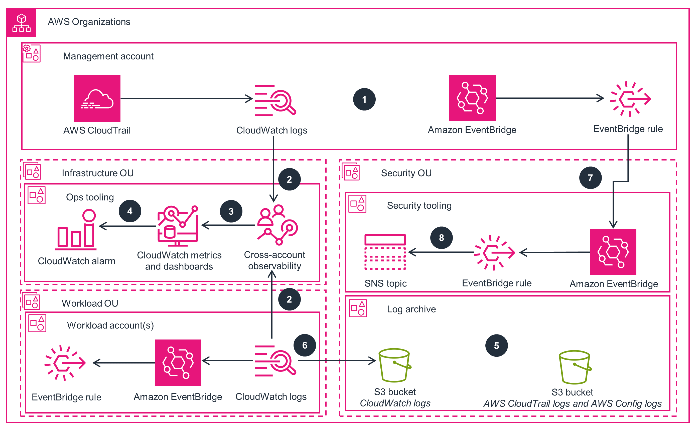
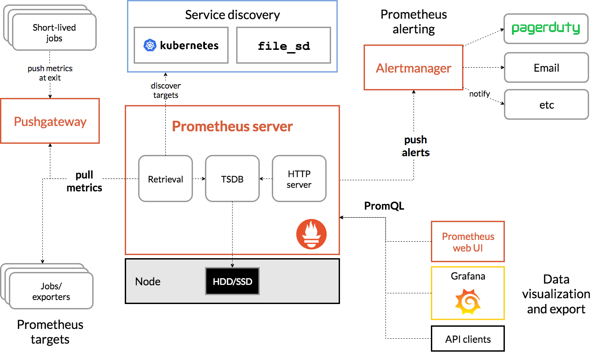
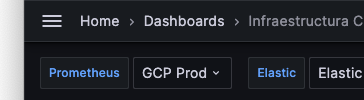

# Parte 1: Infraestructura e IaC

## Identificación Infraestructura
- **Base de Datos**: Se utilizará una base de datos relacional dado que es más compatible para procesar analítica avanzada y conectarla en un futuro con alguna solución de Data Analytics como Google BigQuery, Amazon Redshift o Snowflake, que es parte del requerimiento. Dado que en este caso estamos proponiendo una arquitectura en AWS, la tecnología escogida será Aurora PostgreSQL.
- **Tecnología Pub/Sub**: Existen diversas tecnologías para lograr este propósito, en particular por experiencia personal he utilizado SNS/SQS, RabbitMQ y Redis, sintiendo que todas en general cumplen el propósito y la elección en particular tiene que ir por decisiones previas (si ya se cuenta con una tecnología para Pub/Sub utilizada es mejor mantenerla para evitar fragmentación de tecnologías) o features específicos de una cola de mensajería (como AMQP). Dado que estamos proponiendo una solución simple administrada por AWS, escogeremos SNS/SQS para este ejemplo.
- **Endpoint HTTP para servir datos almacenados**: En general soy más de la idea de utilizar de microservicios basadas en contenedores orquestadas por Kubernetes, utilizando las opciones administradas en la nube como Google Cloud GKE o Amazon EKS, si bien la curva de aprendizaje no es menor, permiten mucha flexibilidad y escalabilidad, y con un buen pipeline de CI/CD se pueden abstraer lo suficiente de los desarrolladores para que solo se centren en escribir código y no preocuparse por la infraestructura. En este caso sin embargo, por simplicidad escogeremos implementar funciones AWS Lambda para lograr el propósito, dado que por ejemplo, en un contexto de piloto, puede ser muy útil levantar una prueba de concepto de bajo costo antes de hacer un deploy más altamente disponible y enterprise grade.

Finalmente, esto se ve representado en el siguiente diagrama de arquitectura de la solución:

## Despliegue de infraestructura mediante código Terraform
### Disclaimers
- Cómo correr los scripts terraform son parte del [quick start guide](https://developer.hashicorp.com/terraform/tutorials/aws-get-started/aws-build).
- Los códigos Terraform fueron generados mediante ChatGPT, sin embargo, se probaron contra una cuenta AWS y editados para corregir errores o detalles durante la generación de las propuestas de scripts (ej: El script de creación de VPC utilizaba un argumento deprecado en la creación del NAT Gateway).
- La contraseña de RDS está definida en variables.tf lo que es una mala práctica. Se realizó por simplicidad pero se recomendaría utilizar un almacenamiento de secretos como AWS Secrets Manager.

### Descripción de los scripts:
- Configuración Base (main.tf / variables.tf): Contiene definiciones generales como la zona AWS del despliegue y variables a utilizar.
- VPC (vpc.tf): Este código despliega una VPC con dos subnets privadas y dos públicas, en las zonas 1A y 1B de Virginia del Norte (us-east-1).
- RDS (rds.tf): Se levantará un servidor de Aurora PostgreSQL Serverless para almacenamiento de datos.
- SNS/SQS (pubsub.tf): Se utilizará SNS/SQS de AWS como tecnología para tener una arquitectura Pub/Sub. Existen otras tecnologías como Apache Kafka, RabbitMQ o Redis.
- Lambda (lambda.tf): Levanta una función AWS Lambda a partir de una imagen Docker compatible.

# Parte 2: Aplicaciones y flujo CI/CD

## API HTTP
- Se creó un handler simple de Lambda que expone dos endpoints. Un endpoint GET el que consultará la base de datos y devolverá las rows de una tabla en formato JSON y un endpoint POST que publicará un mensaje en el tópico SNS.

## Deploy
- Se creó workflow de Github Actions que hace deploy de la función Lambda a una cuenta AWS cuyos parámetros se definen en secrets de Github.
- Ambos scripts son de ejecución manual (workflow dispatch).
- Los scripts hacen build de una imagen docker la cual se sube a un repositorio ECR de AWS.
- Luego esa imagen es lanzada como función Lambda creándola o actualizándola.

Evidentemente esto es un ejemplo muy *barebones* de CI/CD pero cumple el MVP. Se probó que el script funciona de manera exitosa (también hay varios intentos fallidos porque al parecer Github Actions no aceptaba utilizar los actions de terceros ni de Github así que tuve que editar el script para utilizar comandos nativos, en vez de las funciones helper que provee Github).

## Ingesta a BBDD
- Se utilizará una suscripción a SNS a una función Lambda que insertará el mensaje en la base de datos.
- Se dejó un snippet simple de función lambda en la carpeta `app-suscriptor` que se utilizaría para insertar datos en la base de datos.
- Se dejó código terraform para desplegar la suscripción al tópico SNS que invocará esta función Lambda en `infraestructura/lambda-sub.tf`.

También dejar en claro que esto es un ejemplo muy simple de como hacer el loop completo pero dado que también fue preguntado, esto respondería una arquitectura muy simple de poder subscribirse al tópico y escribir dichos mensajes en la base de datos.

En este ejemplo solo estamos tomando insertar en una tabla de usuarios dos campos (nombre, email), pero evidentemente que podríamos sofisticarlo para cualquier modelo de datos.

## Diagrama de arquitectura.
- El diagrama general fue mostrado en la parte 1 de este README.

Si bien es una solución muy simple, podría servir a modo de PoC o MVP de cómo crear una arquitectura PUB/SUB con servicios nativos de AWS. Para mantener los costos más controlados aún en este MVP, se podría reemplazar Aurora por DynamoDB el cual tiene un free tier que nos permitiría probar con menor presupuesto.

# Parte 3: Pruebas de Integración

## Implementar flujo de CI/CD que verifique que la API opera correctamente.
Se implementó un script de CI/CD que de manera rudimentaria ejecuta la función lambda con AWS CLI y compara el status code de retorno para definir si la prueba es exitosa o no. En caso de ser una prueba fallida, el workflow termina con error.

Buscando en la literatura se podrían utilizar otros mecanismos de pruebas de integración para API's, creo que una muy conveniente es utilizar Postman para escribir las pruebas, para luego exportar el script y utilizarlo en un workflow de Github Actions, tal como muestra el siguiente [artículo de Medium](https://medium.com/weekly-webtips/using-github-actions-for-integration-testing-on-a-rest-api-358991d54a20).

Otra herramienta que he utilizado para realizar tests e2e es Cypress, donde también se puede instrumentar un frontend para realizar pruebas, así como también una API.

## Proponer otras pruebas de integración.
Algunas pruebas adicionales que podríamos considerar para la función lambda que expone el GET y publica en el tópico SNS son:
- Probar que la función lambda pueda conectarse a AWS SNS.
- Probar que se pueda publicar en el tópico SNS definido un mensaje de manera exitosa.
- Probar conexión a la base de datos Aurora.
- Probar lectura de datos desde la BBDD Aurora.

En el caso de la función lambda que se suscribe al tópico SNS:
- Conexión a la base de datos Aurora.
- Recepción de mensaje de SNS.
- Escritura del mensaje SNS en la base de datos Aurora.

## Identificar puntos críticos del sistema
Algunos puntos débiles de la solución que podrían afectar al rendimiento son:
- Cold starts de AWS Lambda.
- Debemos asegurar que los mensajes se escriban en el tópico SNS de manera exitosa, así como también su lectura y escritura en la BBDD Aurora por parte del suscriptor.
- A nivel de rendimiento ahora estamos considerando un SELECT simple, sin embargo a medida que vamos sofisticando el sistema probablemente vamos a querer realizar endpoints que realizan queries más avanzadas, donde entran a considerarse factores como sizing correcto de la base de datos, índices adecuados para las consultas a realizar, también se podría utilizar una estructura de caching para el/los endpoints dependiendo de la frecuencia de actualización de los datos lo que también podría optimizar la API así como también quitar carga de la base de datos.

## Cómo robustecer la solución
Si pasamos de un MVP a una solución más production ready consideraría algunos cambios de arquitectura tales como:
- Pasar de funciones lambda a contenedores Docker desplegados en ECS o EKS, donde podremos también utilizar estrategias de escalado horizontal y vertical, además de poder asegurar alta disponibilidad desplegando más de un contenedor en más de una zona de disponibilidad o incluso en distintas regiones.
- Implementar escalamiento horizontal de lecturas de Aurora con réplicas de lectura dependiendo de la demanda.
- Realizar un buen trabajo de diseño de la base de datos para entender cómo los usuarios interactuarán con el modelo de datos, para así implementar índices correctos y una estructura de tablas que sea eficiente para almacenar y consultarlos.
- Implementar un cache de Redis para la API de visualización de datos, invalidando el caché si se realizan nuevas escrituras.

# Parte 4: Métricas y Monitoreo

## Proponer 3 métricas para entender la salud y rendimiento.
Además de las métricas evidentes que mencionan (CPU/RAM/Disco). Algunas métricas de interés pueden ser:
- Latencia de la API (ms por request, observando P50, P95 y P99).
- % de llamadas HTTP fallidas (que no devolvieron 200/201)
- Throughput de la API (transacciones por minuto).

## Proponer una herramienta de observabilidad
Existen diversas herramientas de observabilidad, y dentro del mundo enterprise pueden ser más conocidas herramientas como Datadog, New Relic o Dynatrace entre otras. También los mismos proveedores de la nube proveen opciones nativas de observabilidad, cómo AWS Cloudwatch/Eventbridge/Cloudtrail:

Sin embargo, como en el mundo startup se suele tener mucho menos presupuesto y hay que buscar soluciones ingeniosas como poco dinero, suelo preferir dos herramientas opensource para la observabilidad:
- [Prometheus/Grafana](https://grafana.com/): Prometheus permite monitorear diversas métricas las cuales son almacenads en una base de datos timeseries (TSDB), las cuales pueden ser visualizadas mediante Grafana. Desde el punto de vista de las alertas, se pueden configurar reglas en "Alertmanager" las cuales luego son notificadas a distintos receptores, como e-mail o alguna herramienta de soporte 24/7 como PagerDuty. En lo personal creo que es más cómodo configurar las reglas de alertas en Grafana dado que tiene una interfaz gráfica más amigable.

- [Elastic Observability](https://www.elastic.co/observability): Elastic permite monitorear logs de diversas fuentes. En el caso de EKS suelo utilizar Filebeat para registrar los logs de las aplicaciones de interés mediante un annotation en el recurso. Para el caso de AWS Lambda existe también [Elastic Serverless Forwarder for AWS](https://www.elastic.co/guide/en/esf/current/aws-elastic-serverless-forwarder.html), el cual permitiría también tener los logs de las funciones en Elastic. Sin embargo, una de las funciones que más me gusta de Elastic para la observabilidad es su APM (Application Performance Monitoring) el cual instalando una biblioteca en el deployment (soporta varios lenguajes), permite enviar información de rendimiento a Elastic, además de poder correlacionar logs con eventos y errores.

## Describe como sería la implementación de esta heramienta en la nube
Considerando un supuesto de un entorno Kubernetes, utilizaría los Helm Charts tanto de Elastic como de Prometheus/Grafana, los cuales se encuentran disponibles en los siguientes sitios:
- https://www.elastic.co/guide/en/cloud-on-k8s/current/k8s-deploy-eck.html
- https://github.com/grafana/helm-charts

Para ambas herramientas existen soluciones Cloud Managed lo que sería más sencilla su implementación, y luego lo que se necesitaría sería implementar el agente de Grafana en el cluster EKS para colectar métricas de los nodos y contenedores, así como también desplegar el agente de Filebeat para recolectar los logs de los contenedores. En el caso del APM se despliega una biblioteca en cada uno de los servicios que envía las métricas a un servidor de APM (ya sea self hosted o en la opción Elastic Cloud).

## Escalabilidad de la solución propuesta
Para el caso de Prometheus/Grafana si usamos una solución self hosted probablemente habría que escalar horizontalmente los contenedores de Prometheus (TSDB) y Grafana (visualizador), pero desde el punto de vista de la visualización de métricas, si son sistemas homogeneos, se pueden parametrizar para visualizar de manera individual en Grafana de la siguiente manera:

Además también se podrían generar gráficos generales que sólo muestren información relevante de sistemas que merecen nuestra atención (ej: que una métrica no cumpla el nivel de servicio que esperamos).

En el caso de Elastic es muy intensivo en uso de CPU/RAM así como también de disco (para guardar logs), por ende si bien se puede partir por un nodo único que ejecute todas las funciones (master/data/analytics/etc), estructuras más maduras de elastic comienzan a separar los nodos por funciones además de escalar horizontalmente los nodos para desagregar la información (los índices se shardean en distintos servidores), y también para garantizar que no se pierda la información (se puede guardar el índice en más de un nodo). Más información en https://www.elastic.co/guide/en/elasticsearch/reference/8.15/scalability.html

## Dificultades o limitaciones de la observabilidad
Algunas situaciones que he experimentado son evidentes:
- Elastic se queda sin espacio en disco, por ende, quedamos sin observabilidad hasta solucionarlo.
- El nodo se queda pequeño ante la demanda y por ende analizar la data se hace imposible.
- Podemos implementar autoescalado de disco, pero sin una correcta lifecycle se hace costoso alojar toda la información, por ende es necesario tener buena política de rotación de logs.

# Parte 5: Alertas y SRE

## Reglas y/o umbrales

## SLI y SLO.